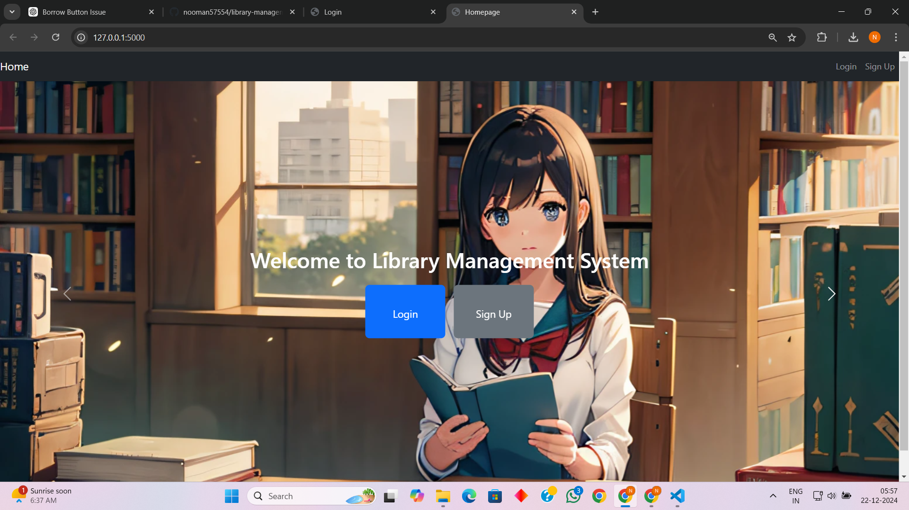
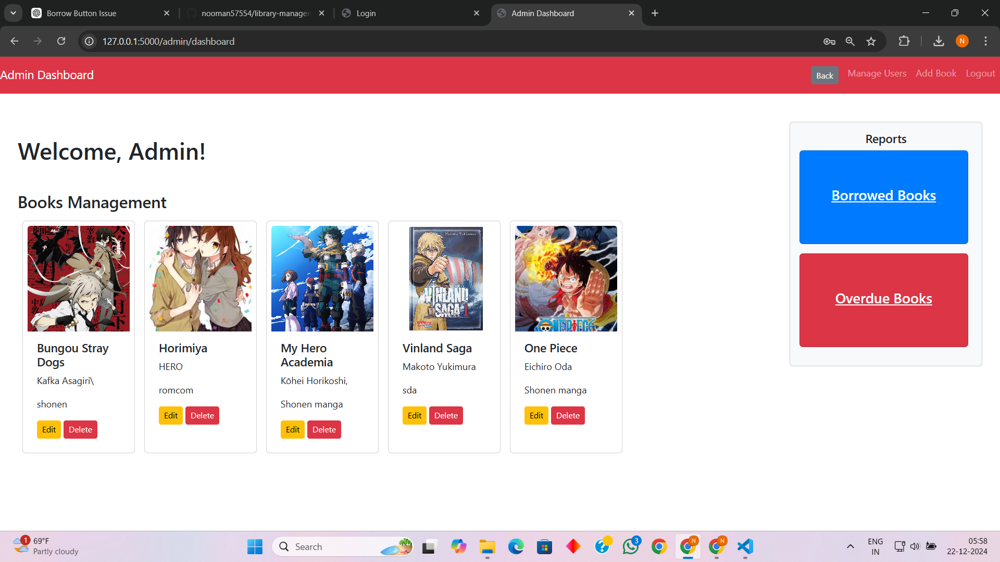
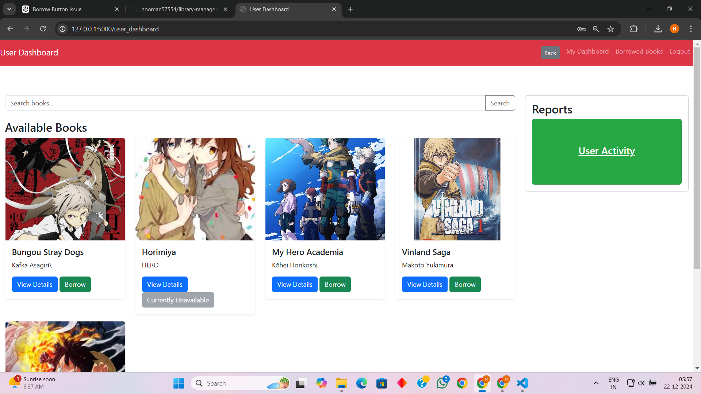

# Library Management System

## Overview
The Library Management System is a web application designed to streamline library operations. It provides user-friendly dashboards for both users and admins to manage books, borrowing activities, and accounts efficiently. The system includes features like user sign-up, secure login, book management, and activity tracking tailored for each role.

---

## Features

### Homepage
- **Login/Sign-Up:**
  - Existing users and admins can log in.
  - New users can create an account.

### Admin Dashboard
- **Books Management:**
  - Add, edit, and delete books.
- **User Management:**
  - View and manage user accounts.
- **Reports:**
  - Track borrowed books and monitor overdue books.

### User Dashboard
- **Search Books:**
  - Search for books by title, author, or genre.
- **Available Books:**
  - Browse and borrow books.
- **Borrowed Books:**
  - View a list of currently borrowed books.
- **User Activity Report:**
  - Generate a detailed report of borrowing activity.

---

## Technical Details
- **Backend:** Flask (Python)
- **Database:** SQLite
- **Frontend:** Bootstrap 4.5 with custom CSS

---

## Installation and Usage

### Prerequisites
- Python 3.8 or higher
- SQLite

### Setup Instructions

1. **Clone the repository:**
   ```bash
   git clone <repository-url>
   cd <project-folder>
   ```

2. **Create a virtual environment:**
   ```bash
   python -m venv venv
   source venv/bin/activate  # On Windows: venv\Scripts\activate
   ```

3. **Install dependencies:**
   ```bash
   pip install -r requirements.txt
   ```

4. **Initialize the database:**
   - Run the `setup_database.py` script to create the database and register the initial admin account with username `admin` and password `admin123`.

5. **Run the application:**
   ```bash
   flask run
   ```

6. **Access the application:**
   - Open your browser and navigate to: [http://127.0.0.1:5000](http://127.0.0.1:5000)

---

## Project Structure
```
├── app.py
├── templates/
│   ├── (all HTML files)
├── static/
│   ├── css/
│   │   └── styles.css
│   ├── images/
│   │   ├── bg1.jpg
│   │   └── bg2.jpg
├── database.py
├── models.py
├── setup_database.py
└── README.md
```

---

## Customization
- Modify styles in `static/css/styles.css`.
- Adjust templates in `templates/` for additional UI enhancements.

---

## Future Enhancements
- Add email notifications for overdue books.
- Implement a mobile-friendly design for better accessibility.
- Include advanced book filtering and sorting options.

---

## Contributors
- Nooman Yousuf

---

## Screenshots
### Login Page


### Admin Dashboard


### User Dashboard

